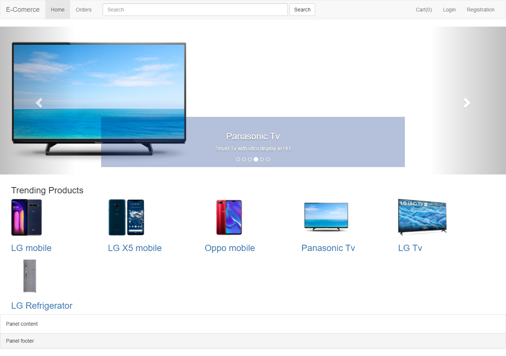
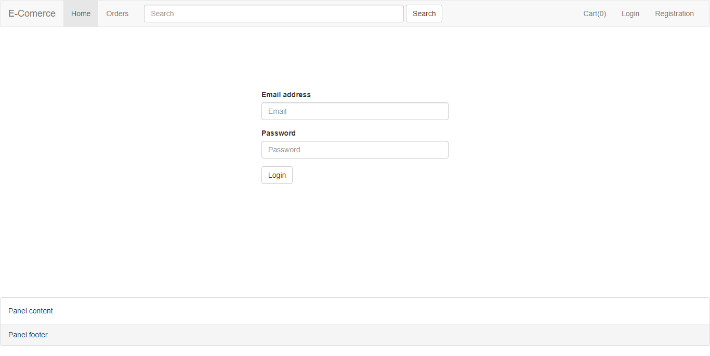
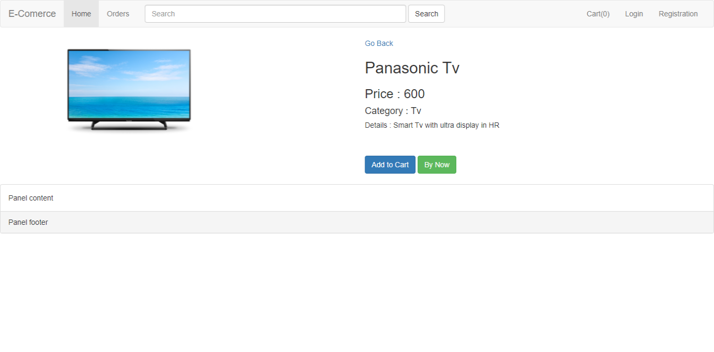
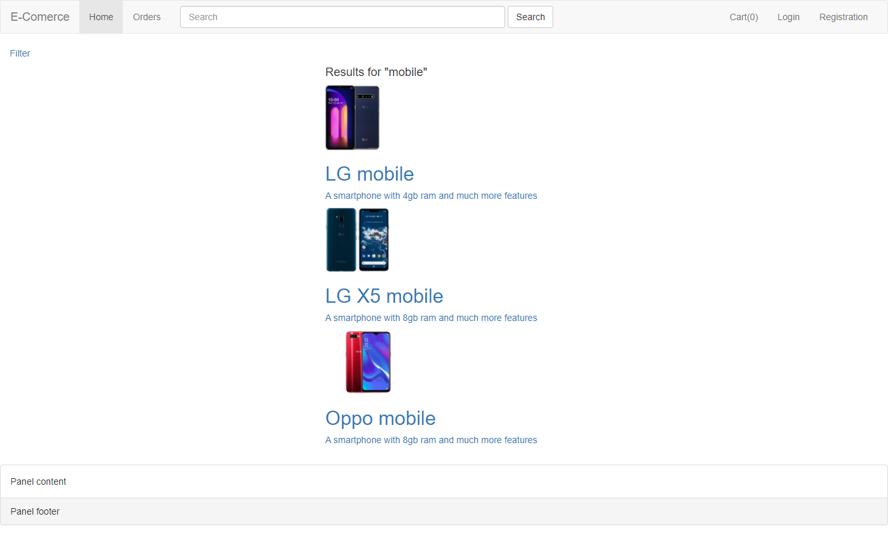

# A basic simple E-commerce site in Laravel

a simple personal project to judge the skill in laravel. Developed in Laravel and to store data MySql database is used.
For the frontend part bootstrap used, laravel-mix is used.

_Snapshots:

